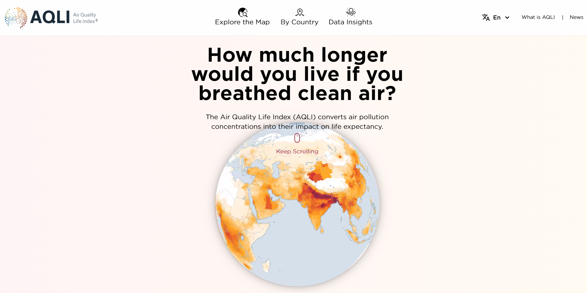
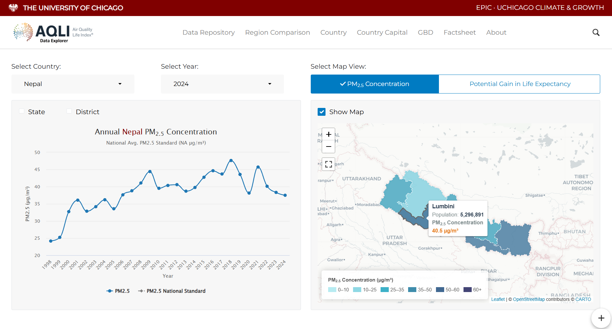

# Air Quality Life Index (AQLI) Data Repository



The **Air Quality Life Index (AQLI)**, developed by the **Energy Policy Institute at the University of Chicago (EPIC)**, translates long-term exposure to fine particulate matter (PM<sub>2.5</sub>) into its effect on life expectancy. Unlike conventional air-quality indicators that report concentrations alone, the AQLI expresses the consequences of sustained particulate pollution as the **potential gain in life expectancy if pollution were permanently reduced to a specified benchmark**.

The AQLI combines peer-reviewed causal evidence on sustained particulate exposure and mortality with global satellite-derived PM<sub>2.5</sub> estimates and population data. Results can be evaluated relative to the **World Health Organization annual PM<sub>2.5</sub> guideline of 5 µg/m³**, a country-specific national standard, or another selected benchmark.

> **Important:** AQLI estimates describe the long-term consequences of annual PM<sub>2.5</sub> exposure. They are not real-time AQI readings, short-term exposure forecasts, or substitutes for regulatory ground-monitoring networks.

---

## Interactive AQLI dashboard



The interactive dashboard provides a research and policy interface for examining the geographic distribution, historical evolution, and potential health consequences of PM<sub>2.5</sub> exposure.

### Core capabilities

- **Country and year selection:** Examine annual results for a selected country and data year.
- **Long-term trend analysis:** Track national PM<sub>2.5</sub> concentrations over time and compare them with the applicable national standard.
- **Subnational exploration:** View estimates at state/province and district/county levels where those geographies are available.
- **Spatial comparison:** Use the map to identify within-country differences that may be hidden by national averages.
- **Health-impact interpretation:** Switch between PM<sub>2.5</sub> concentration and the potential gain in life expectancy associated with permanently meeting a selected air-quality benchmark.
- **Context-rich tooltips:** Review population, pollution concentration, and geographic information for individual administrative units.

### How the dashboard supports analysis

| Research or policy question | Dashboard contribution |
|---|---|
| How has pollution changed over time? | The annual time series identifies persistent trends, reversals, and unusually high or low years. |
| Which areas experience the greatest exposure? | The subnational map highlights spatial heterogeneity and pollution hotspots. |
| Are national averages masking local disparities? | State and district views reveal variation within a country. |
| How far is a location from an air-quality benchmark? | Reference standards provide a consistent basis for evaluating the concentration gap. |
| What is the potential health benefit of cleaner air? | The life-expectancy view converts sustained PM<sub>2.5</sub> reductions into an interpretable health metric. |
| Where might additional research or policy attention be useful? | Trend, exposure, and population information can be assessed together to support prioritization and further investigation. |

The dashboard supports **research, policy analysis, journalism, teaching, and public communication**. It helps users move from a concentration-only interpretation of air pollution toward an exposure- and health-based understanding of its consequences.

---

## Repository contents

- [`data/`](./data/) — country, first administrative level, and second administrative level data in narrow and wide formats.
- [`data/README.md`](./data/README.md) — data sources, field definitions, codebook, units, and file-specific documentation.
- [`aqli.png`](./aqli.png) — screenshot of the AQLI data tool.
- [`aqli_dashboard.png`](./aqli_dashboard.png) — screenshot of the interactive AQLI dashboard.
- [AQLI methodology](https://aqli.epic.uchicago.edu/about/methodology/) — research design, exposure data, population weighting, benchmarks, and life-expectancy calculations.

A typical repository structure is:

```text
.
├── README.md
├── aqli.png
├── aqli_dashboard.png
└── data/
    ├── README.md
    └── ...
```

---

## Methodological foundation

The AQLI is grounded in peer-reviewed research estimating the causal effect of sustained particulate pollution on life expectancy. The foundational studies use China’s Huai River heating policy as a quasi-experimental setting and identify a substantial long-term mortality effect from chronic particulate exposure.

AQLI applies the resulting concentration–life-expectancy relationship to global PM<sub>2.5</sub> and population data. Under the current methodology, a **permanent 10 µg/m³ reduction in PM<sub>2.5</sub> corresponds to approximately 0.98 years of additional life expectancy**, subject to the assumptions and scope of the underlying research.

Principal research references:

1. Chen, Y., Ebenstein, A., Greenstone, M., & Li, H. (2013). *Evidence on the impact of sustained exposure to air pollution on life expectancy from China’s Huai River policy.* Proceedings of the National Academy of Sciences, 110(32), 12936–12941. https://doi.org/10.1073/pnas.1300018110
2. Ebenstein, A., Fan, M., Greenstone, M., He, G., & Zhou, M. (2017). *New evidence on the impact of sustained exposure to air pollution on life expectancy from China’s Huai River Policy.* Proceedings of the National Academy of Sciences, 114(39), 10384–10389. https://doi.org/10.1073/pnas.1616784114
3. van Donkelaar, A., et al. (2021). *Monthly global estimates of fine particulate matter and their uncertainty.* Environmental Science & Technology, 55(22), 15287–15300. https://doi.org/10.1021/acs.est.1c05309

For the complete and authoritative treatment, use the [official AQLI methodology page](https://aqli.epic.uchicago.edu/about/methodology/).

---

## Data interpretation

### PM<sub>2.5</sub> concentration

PM<sub>2.5</sub> represents particulate matter with an aerodynamic diameter of 2.5 micrometres or smaller. Concentrations are reported in **micrograms per cubic metre (µg/m³)**.

### Population-weighted exposure

Population weighting gives greater influence to locations where more people live. The resulting estimate is intended to represent the concentration experienced by the average resident of a geographic unit rather than the unweighted average across its land area.

### Potential gain in life expectancy

Potential gain in life expectancy is a **counterfactual estimate**: the additional years an average resident could gain if PM<sub>2.5</sub> were permanently reduced from the observed annual level to the selected benchmark.

It should not be interpreted as:

- a prediction for a specific individual;
- a short-term health effect;
- a forecast that assumes a policy will be implemented; or
- a measure of daily air quality.

---

## Recommended analytical uses

The repository can support:

- longitudinal analysis of annual PM<sub>2.5</sub> exposure;
- comparisons across countries and administrative units;
- assessment of progress toward WHO or national standards;
- analysis of spatial inequality in pollution exposure;
- estimation and communication of potential life-expectancy gains;
- production of policy briefs, academic figures, news graphics, and teaching materials;
- reproducible extensions of AQLI-based research.

When comparing countries, users should distinguish between the common WHO guideline and country-specific national standards, which may differ in ambition and legal meaning.

---

## Limitations and responsible use

1. **Annual rather than real-time exposure:** The data are designed for long-term exposure analysis and should not be used to infer hourly or daily conditions.
2. **Satellite-derived estimates:** AQLI PM<sub>2.5</sub> estimates may differ from individual ground-monitor readings because the two sources represent different spatial and temporal scales.
3. **Population weighting:** Population-weighted averages can conceal exposure differences within a geographic unit; subnational analysis is preferable where available.
4. **Counterfactual interpretation:** Potential life-expectancy gains assume that lower pollution is sustained over time.
5. **Cross-country standards:** National standards vary, so comparisons relative to national standards should be interpreted with care.
6. **Version consistency:** Analyses should record the data release, year, geographic level, benchmark, and any filtering or aggregation applied.

---

## Quick links

- [Data files](./data/)
- [Data documentation and codebook](./data/README.md)
- [AQLI methodology](https://aqli.epic.uchicago.edu/about/methodology/)
- [AQLI website](https://aqli.epic.uchicago.edu/)

---

## Reuse and citation

You may reuse the data in research, reports, visualizations, and news coverage subject to the repository’s license and attribution requirements. Please cite the AQLI and link to the original project.

### Suggested academic citation

```bibtex
@misc{aqli_2024,
  title     = {How much longer would you live if you breathed clean air?},
  year      = {2024},
  month     = sep,
  publisher = {Energy Policy Institute at the University of Chicago},
  journal   = {Air Quality Life Index},
  url       = {https://aqli.epic.uchicago.edu/}
}
```

For a reproducible analysis, also report:

- the repository or release version;
- the data year;
- the geographic level;
- the pollution benchmark used; and
- the date the data were accessed.

### Suggested media attribution

> Air Quality Life Index (AQLI), Energy Policy Institute at the University of Chicago.

---

## Contact

For questions about the AQLI or its data:

**aqli-info@uchicago.edu**
