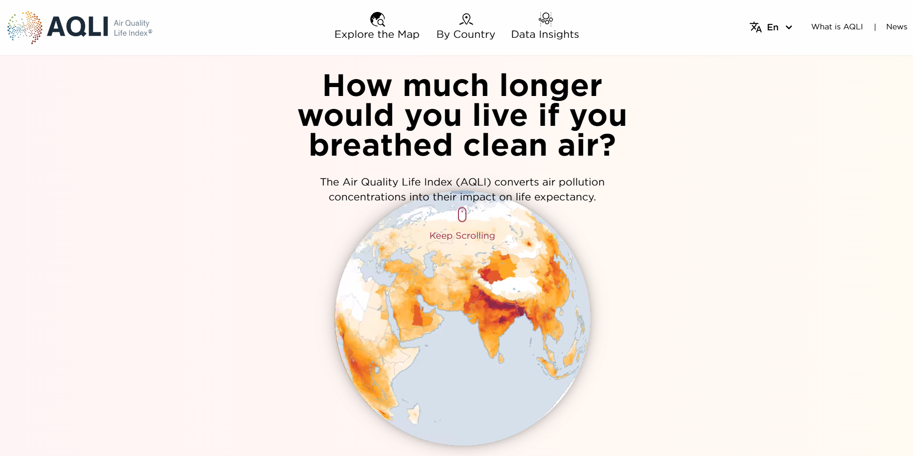
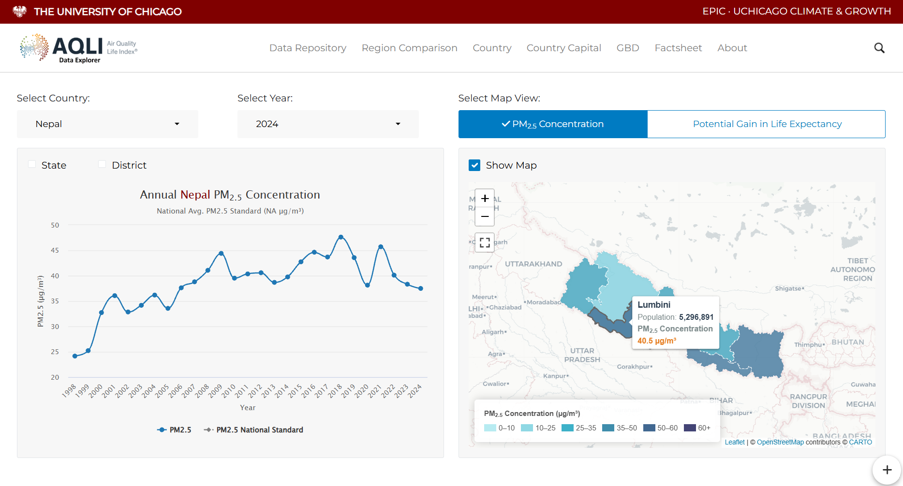

# Air Quality Life Index (AQLI) Data Repository

The **Air Quality Life Index (AQLI)**, developed by the **Energy Policy Institute at the University of Chicago (EPIC)**, translates long-term exposure to fine particulate matter (PM2.5) into its effect on life expectancy.

AQLI combines peer-reviewed evidence on sustained particulate exposure and mortality with satellite-derived PM2.5 estimates and population data. Results can be evaluated relative to the **World Health Organization annual PM2.5 guideline of 5 µg/m³**, a country-specific national standard, or any other selected benchmark.

> **Important:** AQLI estimates describe the long-term consequences of annual PM2.5 exposure on life expectancy. They are not real-time AQI readings, short-term exposure forecasts, or substitutes for regulatory ground-monitoring networks.

---

## Data releases

| Release | Status | Contents |
|---|---|---|
| [`AQLI Annual Update 2025 data/`](./AQLI%20Annual%20Update%202025%20data/) | **Latest completed release** | GADM0, GADM1, and GADM2 data archives and release documentation |
| [`AQLI Annual Update 2026 data/`](./AQLI%20Annual%20Update%202026%20data/) | **Work in progress** | Data under active development for the next annual update |
| [`archive/`](./archive/) | Historical | Earlier archived data |

> **2026 data are under active development and should not be treated as a finalized AQLI release until report is published.**

Each annual-release directory contains its own README with release-specific field definitions, units, source information, and limitations.

---

## Geographic levels

AQLI data are distributed at multiple administrative levels based on GADM boundaries:

- **GADM0** — country level
- **GADM1** — first administrative level, such as states, provinces, or regions
- **GADM2** — second administrative level, such as districts, counties, or municipalities

Availability can vary by country depending on the underlying geographic data.

---

## Core measures

The release files contain three principal AQLI measures:

- **`pm`** — annual average PM2.5 concentration, reported in µg/m³
- **`who`** — potential gain in life expectancy if PM2.5 were permanently reduced to the WHO annual guideline
- **`nat`** — potential gain in life expectancy if PM2.5 were permanently reduced to the applicable national standard

See the README inside each annual-release directory for the complete codebook and release-specific year coverage.

---

## Interactive AQLI dashboard

The AQLI dashboard provides an interface for exploring the geographic distribution, historical evolution, and potential health consequences of PM2.5 exposure.

It supports:

- country and year selection;
- long-term PM2.5 trend analysis;
- state/province and district/county exploration where available;
- comparison with WHO and national standards;
- spatial analysis of within-country differences; and
- interpretation of potential gains in life expectancy.

For the public AQLI interface, visit the [AQLI website](https://aqli.epic.uchicago.edu/).

---

## Methodology

The AQLI is grounded in peer-reviewed research estimating the causal effect of sustained particulate pollution on life expectancy.

Under the current methodology, a **permanent 10 µg/m³ reduction in PM2.5 corresponds to approximately 0.98 years of additional life expectancy**, subject to the assumptions and scope of the underlying research.

Principal references include:

1. Chen, Y., Ebenstein, A., Greenstone, M., & Li, H. (2013). *Evidence on the impact of sustained exposure to air pollution on life expectancy from China’s Huai River policy.* Proceedings of the National Academy of Sciences, 110(32), 12936–12941. https://doi.org/10.1073/pnas.1300018110
2. Ebenstein, A., Fan, M., Greenstone, M., He, G., & Zhou, M. (2017). *New evidence on the impact of sustained exposure to air pollution on life expectancy from China’s Huai River Policy.* Proceedings of the National Academy of Sciences, 114(39), 10384–10389. https://doi.org/10.1073/pnas.1616784114
3. van Donkelaar, A., et al. (2021). *Monthly global estimates of fine particulate matter and their uncertainty.* Environmental Science & Technology, 55(22), 15287–15300. https://doi.org/10.1021/acs.est.1c05309

For the complete and authoritative treatment, see the [official AQLI methodology](https://aqli.epic.uchicago.edu/about/methodology/).

---

## Data interpretation

### PM2.5 concentration

PM2.5 is particulate matter with an aerodynamic diameter of 2.5 micrometres or smaller. Concentrations are reported in **micrograms per cubic metre (µg/m³)**.

### Population-weighted exposure

Population weighting gives greater influence to locations where more people live. A population-weighted estimate is intended to represent the concentration experienced by the average resident of a geographic unit rather than the unweighted average across its land area.

### Potential gain in life expectancy

Potential gain in life expectancy is a **counterfactual estimate**: the additional years an average resident could gain if PM2.5 were permanently reduced from the observed annual level to the selected benchmark.

It should not be interpreted as:

- a prediction for a specific individual;
- a short-term health effect;
- a forecast that assumes a policy will be implemented; or
- a measure of daily air quality.

---

## Limitations and responsible use

Users should review the README associated with the specific annual release before analysis.

Important considerations include:

1. **Annual rather than real-time exposure:** AQLI data are designed for long-term exposure analysis and should not be used to infer hourly or daily conditions.
2. **Satellite-derived estimates:** AQLI PM2.5 estimates may differ from individual ground-monitor readings because the sources represent different spatial and temporal scales.
3. **Geographic availability:** Administrative-level coverage varies across countries.
4. **Population weighting:** Population-weighted averages can conceal exposure differences within a geographic unit.
5. **Counterfactual interpretation:** Potential life-expectancy gains assume that lower pollution is sustained over time.
6. **Cross-country standards:** National standards differ in both level and legal meaning.
7. **Version consistency:** Reproducible analyses should record the annual release, data year, geographic level, benchmark, and any filtering or aggregation applied.
8. **Historical revisions:** Earlier-year pollution estimates may change across annual releases as the underlying PM2.5 model and calibration data are updated.

---

## Reproducible use

When using AQLI data in research, reporting, or visualization, record:

- the annual release used;
- the data year;
- the geographic level;
- the pollution benchmark;
- any transformations, filtering, or aggregation applied; and
- the date the data were accessed.

For finalized analysis, use a completed annual release rather than the active 2026 work-in-progress directory.

---

## Citation

Please cite the **Air Quality Life Index (AQLI), Energy Policy Institute at the University of Chicago**, and identify the annual data release used in your analysis.

Suggested attribution:

> Air Quality Life Index (AQLI), Energy Policy Institute at the University of Chicago.

For methodology and research references, see the [official AQLI methodology](https://aqli.epic.uchicago.edu/about/methodology/).

---

## License

This repository is currently distributed under the **Creative Commons Attribution 4.0 International (CC BY 4.0)** license. See [`LICENSE`](./LICENSE) for the governing terms.

Third-party materials remain subject to their respective licenses and terms of use.

---

## Quick links

- [2025 completed data release](./AQLI%20Annual%20Update%202025%20data/)
- [2026 work-in-progress data](./AQLI%20Annual%20Update%202026%20data/)
- [Archived data](./archive/)
- [AQLI methodology](https://aqli.epic.uchicago.edu/about/methodology/)
- [AQLI website](https://aqli.epic.uchicago.edu/)

---

## Contact

For questions about the AQLI or its data:

**aqli-info@uchicago.edu**
