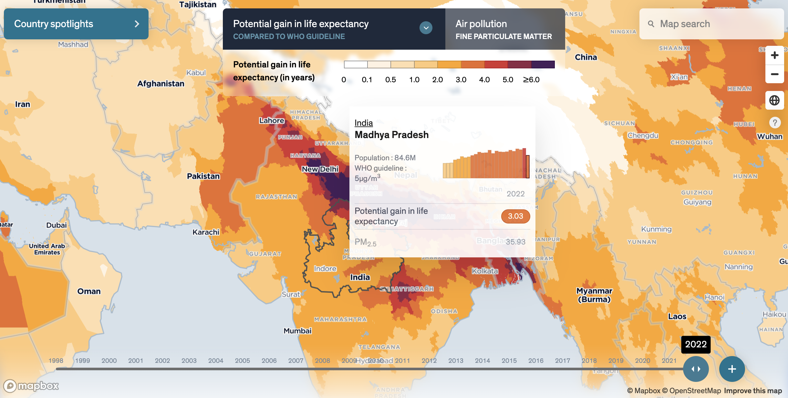

# AQLI data


The **Air Quality Life Index (AQLI) by the Energy Policy Institute at the University of Chicago** showcases the potential for life expectancy gains if air pollution levels were reduced. Fine particle pollution (PM<sub>2.5</sub>) shortens people's lives when they breathe them in, the AQLI projects how many more years people could live if pollution was reduced to meet the World Health Organization's guidelines (an annual exposure of 5 µg/m<sup>3</sup>). Using global, satellite-derived data, the AQLI provides a detailed picture of air pollution levels and their health impact around the world, tracking changes from 1998 to 2022. This information can be used to inform policies and actions that aim to improve air quality and public health.

---
## Quick links
* [data](./data/) contains data files for country, first, and second administrative level —in narrow and wide data formats.
* In the [data Readme.md](./data/Readme.md) you'll find the description of the data, sources, and codebook explaining the variables.
* The [methodology](https://aqli.epic.uchicago.edu/about/methodology/) summarizes the research behind the Air Quality Life Index, also available here.

---
## How to reuse this data and cite this project
You are welcome to reuse the data in your reports or news stories as long as you abide the terms of the license, which means you have to give credit and link back to the original work.

For academic citations, here is the BibTex citation:

```
@misc{aqli_2024,
	title        = {How much longer would you live if you breathed clean air?},
	year         = 2024,
	month        = sep,
	journal      = {AQLI},
	publisher    = {Energy Policy Institute at the University of Chicago},
	url          = {https://aqli.epic.uchicago.edu/}
}
```

For media references, use 'Air Quality Life Index (AQLI) by the Energy Policy Institute at the University of Chicago' and link to 'https://aqli.epic.uchicago.edu/'

---
## Contact us

aqli-info@uchicago.edu 

